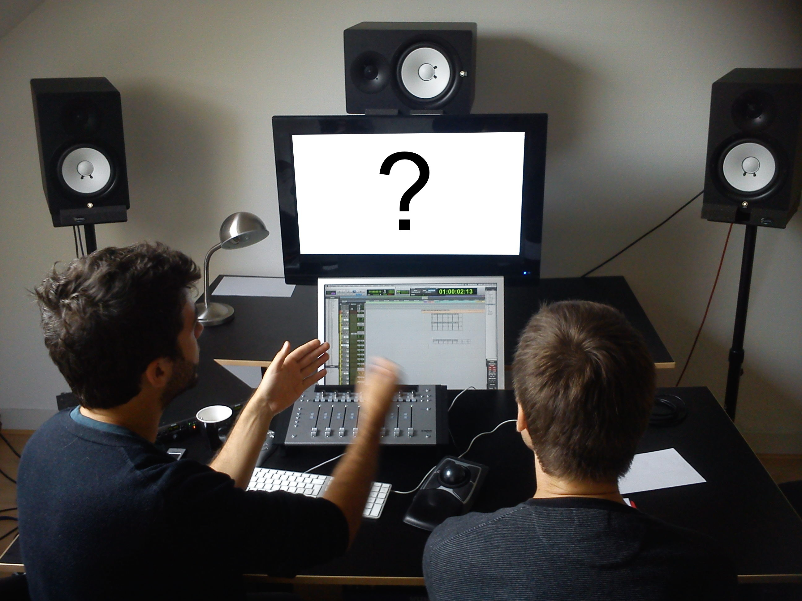
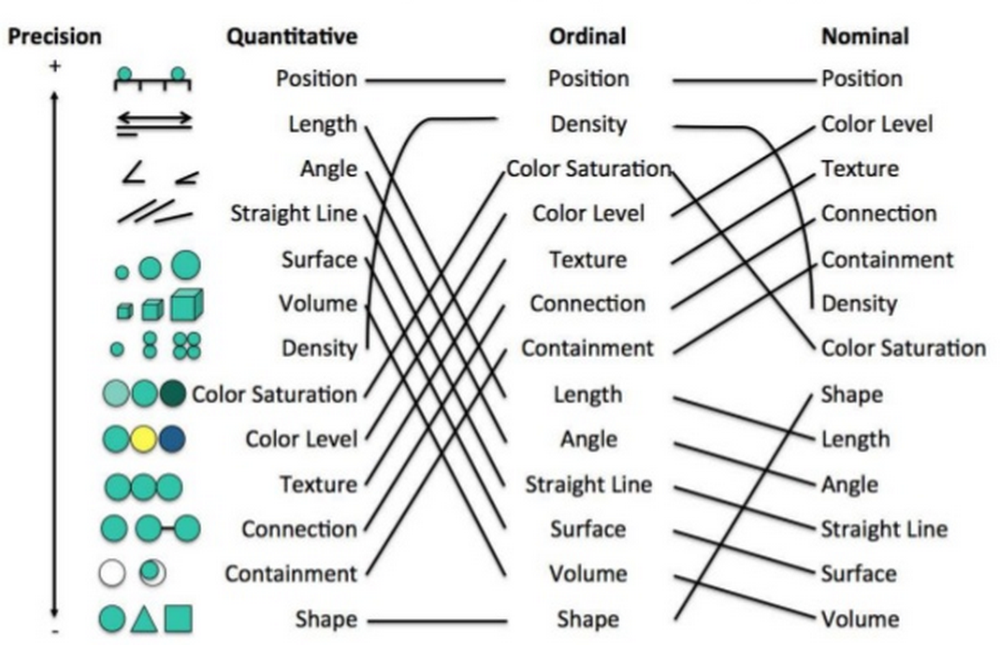
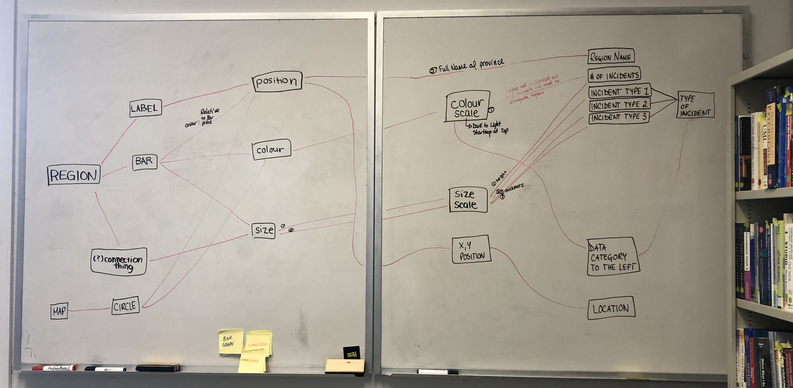
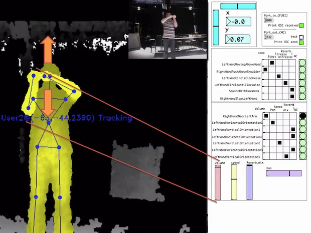
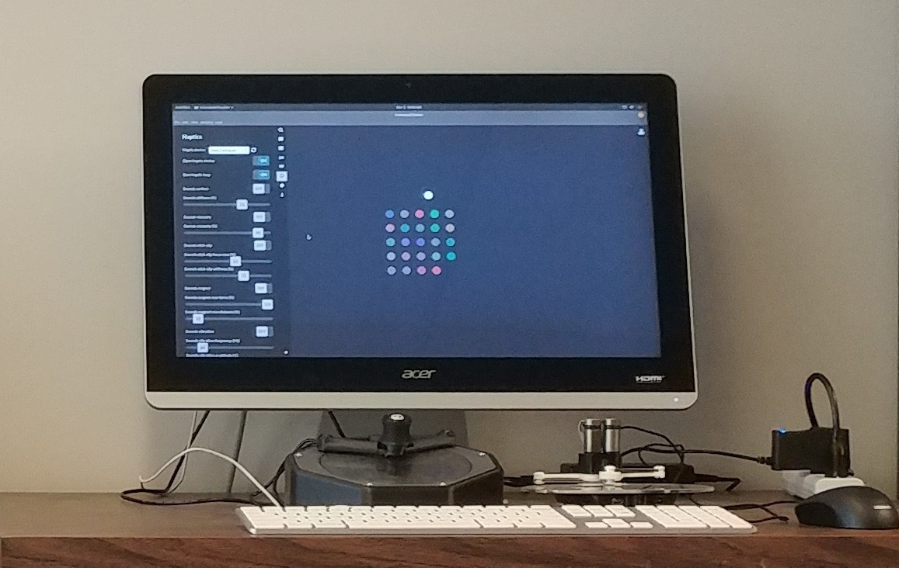
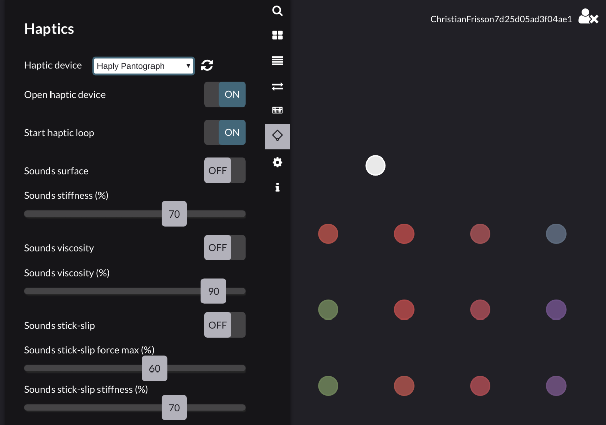
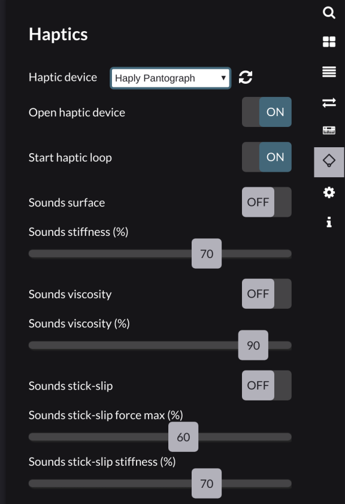
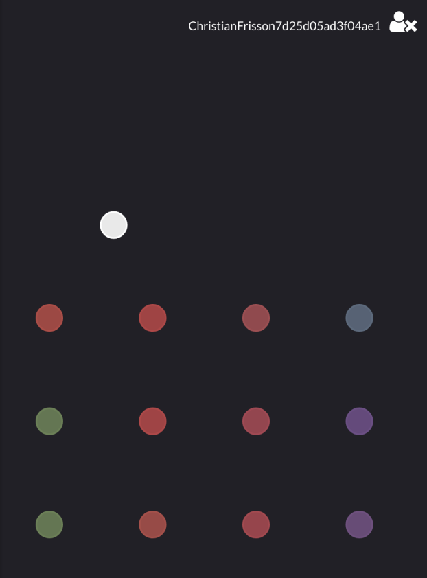
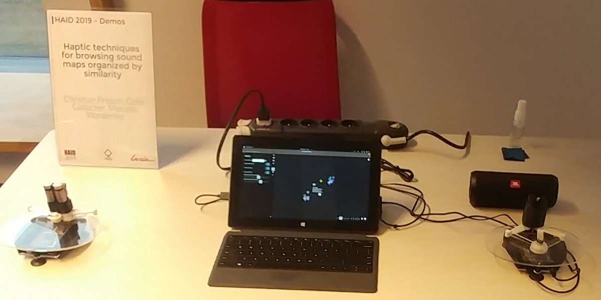

<!--slide-->

# Cartographie
 

Visualisations de collections de sons: AudioMetro [<a href="https://doi.org/10.5281/zenodo.1417245">ISMIR'14</a> + <a href="https://doi.org/10.1145/2636879.2636880">ACM AM'14</a>]

Note: When they create sounds, what information do sound practitioners visualize? There are two visual displays in this studio, where we conducted contextual inquiries. The bottom screen is assigned to the timeline of a non-linear media editor (AVID/Digidesign Pro Tools). The top screen assignations are more flexible: searching for sounds, synthesizing sounds, applying effects.

<!--slide-->

## Cartographie

par: Charles-Eric Dessart, Vivian Genaro Motti, Jean Vanderdonckt,
      <i>Animated Transitions between User Interface Views</i>, ACM AVI'12</small>
 
originellement: Jock Mckinlay, <i>Automatic design of graphical presentations</i>, PhD,
    Stanford, 1986

Note: How do one design information visualizations? One method is to map data categories, including metrics from audio features extracted from sounds, to visual variables. You can see in this graph with precision on the vertical axis and type of data in the horizontal axis that position is a preferred visual variable.

<!--slide-->

## Cartographie

Esquisse par <a href="https://lisahynes.weebly.com/">Lisa Hynes</a>  &amp; <a href="http://teenah.ca/">Tina Huynh</a> [IEEE InfoVis'18 poster]
 Univ. de Calgary (<a href="https://gitlab.cpsc.ucalgary.ca/EnergyVis">EnergyVis</a> Conditions)

Note: Information visualization designers often rely on sketching throughout their design process. Here we asked 2 students from UofC to sketch the data mapping for an infovis project. I suggested to get inspired from visual representations of data flow tools that multimedia practitioners use (PureData and libmapper).

<!--slide-->

# Cartographie

### Prototyping gestural interaction

 <video width="auto" height="80%" controls loop>
  <source alt="" src="videos/DeviceCycleCut.mp4" type="video/mp4">
Your browser does not support the video tag.
</video> 

Reusable input devices (space navigator and shuttle jog/dial) <a href="https://github.com/ChristianFrisson/DeviceCycle">DeviceCycle</a> [<a href="https://doi.org/10.5281/zenodo.1177771">NIME'10</a>]

 

<!--slide-->

# Cartographie

<a href="http://staff.umons.ac.be/fabien.grisard/">Fabien Grisard</a>: MashtaCycle [<a href="https://doi.org/10.1007/978-3-319-03892-6_14">Springer INTETAIN'13 Springer LNCS</a>]

Note: What if we want to design content-based collaborative installations or performances not behind a laptop screen? Fabien Grisard, at the time student at UMONS numediart, now research engineer there, got inspired by sound painting to map free-form gestures to content-based browsing and manipulation. Let's watch a video of Belgian artist Gauthier Keyaerts using this tool. -->

<!--slide-->

Note:

- Yes, just a desktop computer, with a keyboard and a mouse.
- Wait, no. There are devices between the screen and the keyboard.
- I'll come back at them later.
- What kind of tool do you think is on screen?
- Quite blurry right? Let's have a look at a screenshot rather than at this photo.

<!--slide-->

Note:

- Test: Does anybody have a hint on what this tool is for?

<!--slide-->

Note:

- OK, let's divide the screen into two vertical panes.
- On the left you see a layout of widgets with Haptics as title.
- On the right you see shapes, actually discs, with various positions and colors.
- Sounds like an information visualisation right?

<!--slide-->

 <video width="100%" height="auto" controls autoplay loop>
  <source alt="" src="images/projects/FreesoundTrackerOscillations.mp4" type="video/mp4">
Your browser does not support the video tag.
</video> 

Note:

- The moving disc colored in white that you see on the left half of the video is actually a pointer, its movement is controlled by the device on the right in the video. A haptic device. Not only can we use this haptic device to control the position of a pointer, but we also can use this haptic device to move the hand of the person manipulating. And even produce subtle effects, as you can see from the list of parameters in the Haptics pane on the left. The blue/violet disc produces a vibration of 60 Hz once the pointer hovers it, while the gray disc produces a vibration of 270 Hz on hover. The LEDS from the hardware board activate when a current is sent to each motor, here triggered by vibrations. Imagine that we can assign variable values of haptic effects to each of the discs, as we would assign visual variables in a scatter plot in information visualization.

<!--slide-->

Haptification of Sound Collections <a href="https://github.com/idmil/freesound-tracker">FreesoundTracker</a> [<a href="https://hal.inria.fr/hal-02050235">HAID'19</a>]

Note:

- MediaCycle, the framework for content-based multimedia browsing that I contributed to develop during my PhD thesis, is not opensource, so I had to reinvent the wheel to pursue similar research.
- I am currently studying how we can bind sound features to haptic feedback.
- Forked Freesound Explorer a content-based and web-based browser for browsing freesound collections by Frederic Font et al. from UPF. I embedded it in a web-browser application (with web engine Electron), to enable to map input events from haptics devices, not standardized in the web browser.
- I use these openhardware devices made by Haply from Montreal. 2DOF pantographs designed in 1990's at McGill by Vincent Hayward and Christoph Rammstein now at Immersion.
- Presented a demo at the HAID conference in 2019 at Inria, France

<!--slide-->

<!-- .slide: data-background="images/projects/FreesoundTrackerKnownItemSearchCrop.png" data-background-size="60%" data-background-color="#000" -->

Note:

- Closeup of Freesound Tracker to expose what haptic properties one can bind to each sound.
- I am now examining how to extract material properties from sounds, or synthesize sounds with material properties, to study audio-haptic mappings.
- Here is how is close the loop.
