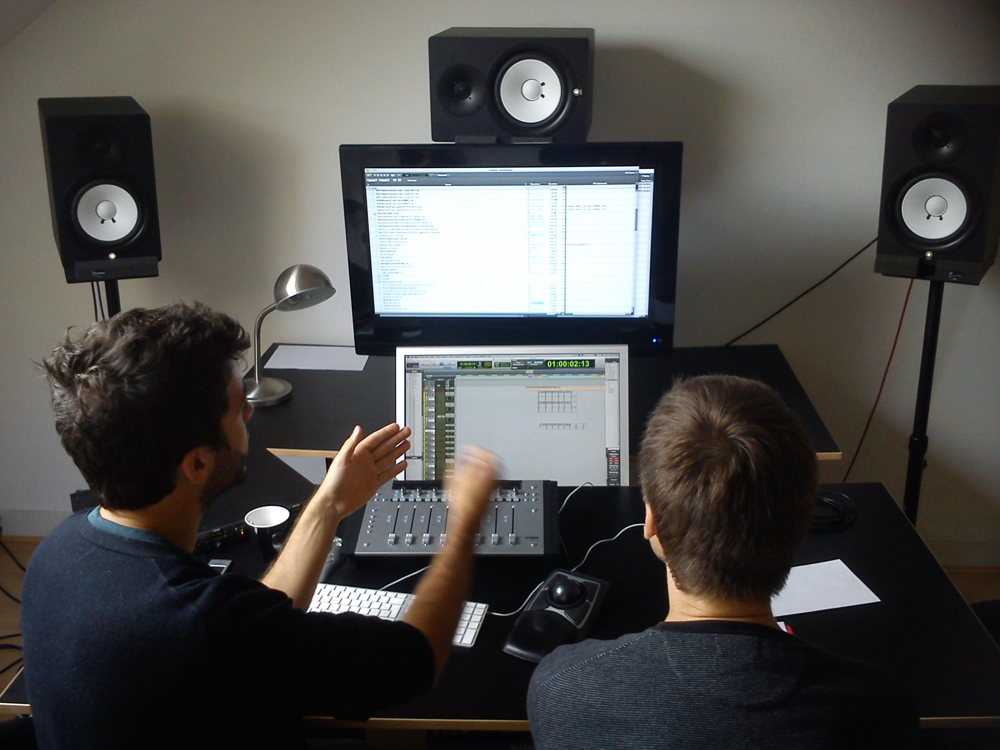
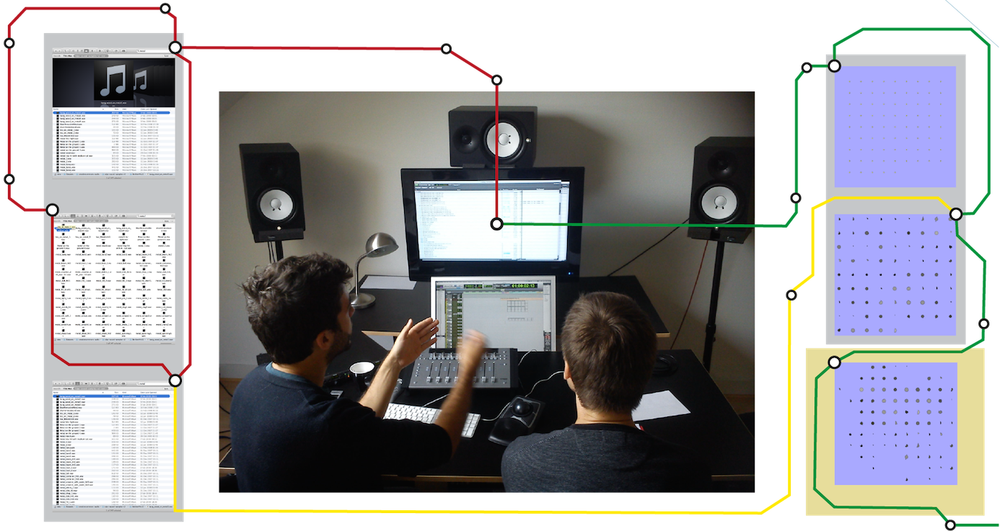
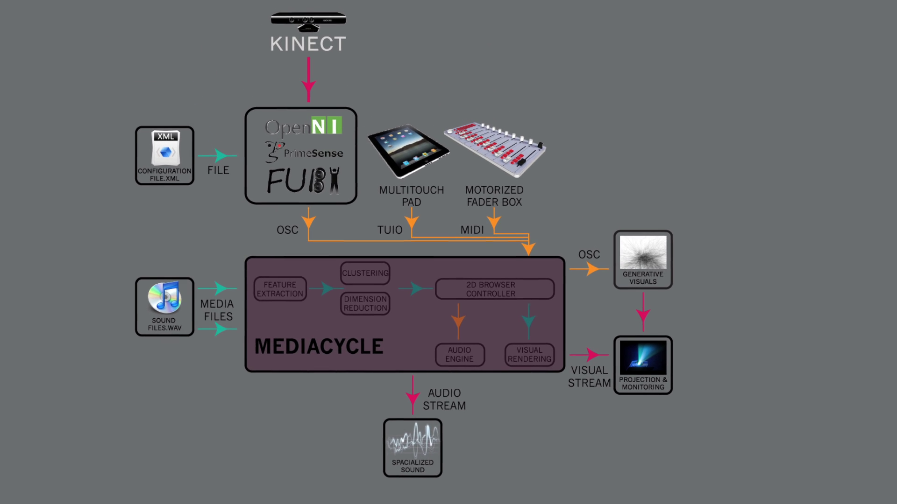
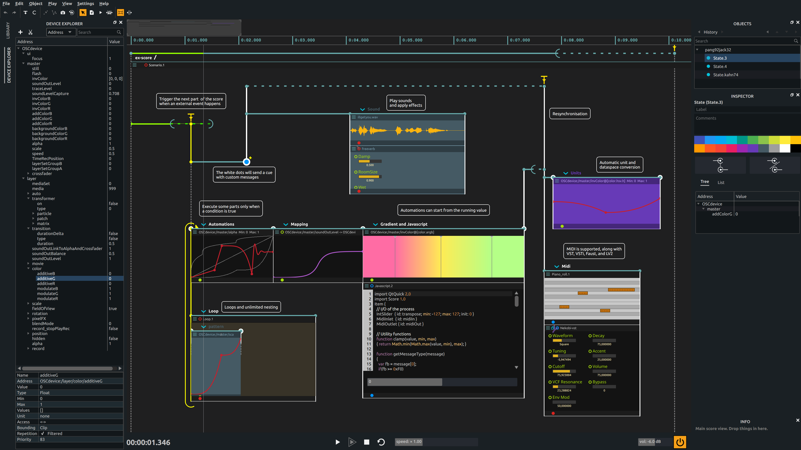

<!-- Use these links to change the theme at runtime: -->
<!-- TODO: style this as menu component or make sure it is ignored for deployment -->
<!-- 

<a href="#" onclick="document.getElementById('theme').setAttribute('href','css/theme/black.css'); return false;">black</a>
<a href="#" onclick="document.getElementById('theme').setAttribute('href','css/theme/white.css'); return false;">white</a>
<a href="#" onclick="document.getElementById('theme').setAttribute('href','css/theme/league.css'); return false;">league</a>
<a href="#" onclick="document.getElementById('theme').setAttribute('href','css/theme/sky.css'); return false;">sky</a>
<a href="#" onclick="document.getElementById('theme').setAttribute('href','css/theme/beige.css'); return false;">beige</a>
<a href="#" onclick="document.getElementById('theme').setAttribute('href','css/theme/simple.css'); return false;">simple</a>
<a href="#" onclick="document.getElementById('theme').setAttribute('href','css/theme/serif.css'); return false;">serif</a>
<a href="#" onclick="document.getElementById('theme').setAttribute('href','css/theme/blood.css'); return false;">blood</a>
<a href="#" onclick="document.getElementById('theme').setAttribute('href','css/theme/night.css'); return false;">night</a>
<a href="#" onclick="document.getElementById('theme').setAttribute('href','css/theme/moon.css'); return false;">moon</a>
<a href="#" onclick="document.getElementById('theme').setAttribute('href','css/theme/solarized.css'); return false;">solarized</a>

 -->

<!-- Use this to add a background image: -->
<!-- .slide: id="start" data-background="images/projects/MashtaCycleThumbnail1060p.jpg" data-state="start"-->

<!-- Use this transparent styling in case of a background image: -->
<!-- 
 -->

## Navigation dans des collections multimedia

### de la cartographie vers l'écriture

<!-- 
  -->

<a href="https://frisson.re" title="Christian Frisson's Website">Christian Frisson</a>

### Workshop IEA LaBRI-IDMIL

#### 2020-11-19

Note:
* Bonjour, Hi. Je m'apppelle Christian Frisson.
* Je vais vous parler de navigation dans des collections multimedia: de la cartographie à l'écriture.

<!--section-->

## [IDMIL](http://www-new.idmil.org/)

Note:

- Je suis chercheur postdoctoral à l'Université McGill, à l'IDMIL (Input Devices and Music Interaction Lab).

<!--section-->

## De la cartographie vers l'écriture

Studios Dame Blanche , Bruxelles, Belgique, 2013

Note: Voici 2 ingénieurs du son dans un studio de post-production. Dans cet espace de travail, il y a 2 écrans. Sur l'écran du haut, un navigateur permet de choisir des sons à la carte. Sur l'écran du bas, un séquenceur permet d'écrire des séquences avec ces sons.

<!--slide-->

# De la cartographie

Visualisations de collections de sons: AudioMetro [<a href="https://doi.org/10.5281/zenodo.1417245">ISMIR'14</a> + <a href="https://doi.org/10.1145/2636879.2636880">ACM AM'14</a>]

Note: 
<!-- * L'un des ingénieurs du son explique à l'autre sa méthode de travail, lors d'une enquête contextuelle.  -->
* Nous avons collaboré pour concevoir des visualisations pour faciliter la navigation dans des collections de sons, parce que c'est fastidieux avec des explorateurs de fichiers.
* A gauche sont exposées 3 methodes exemplaires de présentation dans l'explorateur de fichier Finder de macOS, de haut en bas: 1) Galerie ou CoverFlow, pour la présentation visuelle serielle rapide de jaquettes d'albums de musique; 2) Icônes, en grille, et 3) Liste, avec métadonnées. 
* A droite, nous avons proposé 3 représentations, de haut en bas: 1) une grille de sons ordonnés alphabétiquement par nom de fichier, 2) cette même grille avec des icônes ou glyphes générés à partir de caractéristiques extraites des sons, et 3) ces glyphes positionés par réduction de dimension sur ces caractéristiques.
* Cette mise en correspondance de caractéristiques extraites du son vers des variables visuelles (position, couleur, etc...) s'appelle en anglais mapping, ici j'ai traduit en un mot par cartographie.

<!--slide-->

<!-- .slide: data-background-color="#999"-->

# De la cartographie

MashtaCycle [<a href="https://doi.org/10.1007/978-3-319-03892-6_14">Springer INTETAIN'13 Springer LNCS</a>]

Note: Et si on voulait naviguer dans ces cartes de sons autrement qu'avec un clavier, une souris et un écran de bureau ou de studio? Par exemple, en déplaçant son corps à la place d'un  pointeur. Et en faisant des gestes pour appliquer des effets aux sons. Voici une démonstration vidéo appliquant nos travaux dans une installation-performance.

<!--slide-->

<!-- .slide: id="MashtaCycleVideo" data-background-video="videos/MashtaCycleCut.mp4" data-state="MashtaCycleVideo" -->

Note: 
* Gauthier Keyarts improvise ici une séquence sonore en naviguant dans un espace physique mis en correspondance avec l'espace numérique de sons organisés par leurs caractéristiques.
* Des gestes dans l'air (non pas ancillaires) communiquent éventuellement aux spectateurs un fort aspect scénique, mais notre improvisateur/performeur/navigateur n'a pas de retour sur ses gestes tel qu'il est possible avec avec un instrument tangible, physique.

<!--slide-->

<!-- Use this to add a background image: -->
<!-- .slide: data-background="images/projects/2020-03-05-IDMIL-Haptic-Showroom.jpg" -->

Note: 
* A l'IDMIL, je m'intéressais à comment étendre la mise en correspondance des caractéristiques de sons, non seulement avec des variables visuelles pour la visualisation, mais aussi avec des variables tactiles pour l'haptification, avec ce genre de dispositifs à retour d'effort.
* Pour expérimenter ces mises en correspondances, j'ai détourné Freesound Explorer, parce que MediaCycle le cadriciel développé pour mes travaux précédents pendant mon doctorat n'était pas opensource. Post-scriptum: nous travaillons à rendre MediaCycle opensource. Mais j'aimerais profiter de l'occasion pour montrer une idée des auteurs de Freesound Explorer que je trouve inspirante pour transitioner de la cartographie vers l'écriture.

<!--slide-->

<!-- .slide: data-background-color="#000" -->

# Vers l'écriture

 <video width="100%" height="auto" controls>
  <source alt="" src="videos/FreesoundExplorerFollowTheBass.mp4" type="video/mp4">
Your browser does not support the video tag.
</video> 

<a href="https://github.com/ffont/freesound-explorer">Freesound Explorer</a> [<a href="http://eecs.qmul.ac.uk/~keno/20.pdf">WAC'17</a>] par Frederic Font &amp; Giuseppe Bandiera

Note:
* Freesound Explorer présente aussi des sons en cartes organisées par leurs caractéristiques. Dans cette video, je commencerai par parcourir avec mon pointeur un groupe de sons similaires, pour ensuite identifier des sons qui sont séquencés dans des chemins pré-établies, pré-écrits.

<!--slide-->

<!-- .slide: data-background-color="#000" -->

# Vers l'écriture

Jean-Michaël Celerier et contributeurs,  <a href="https://github.com/ossia/score">ossia score</a>

Note: 
* Ici une capture d'écran d'ossia, dont un composant pour la lecture de sons.
* Je finis par une question ouverte: comment pourrait-on allier une navigation par des cartographies de sons avec une pré-écriture de séquences sonores ou multimedia?
